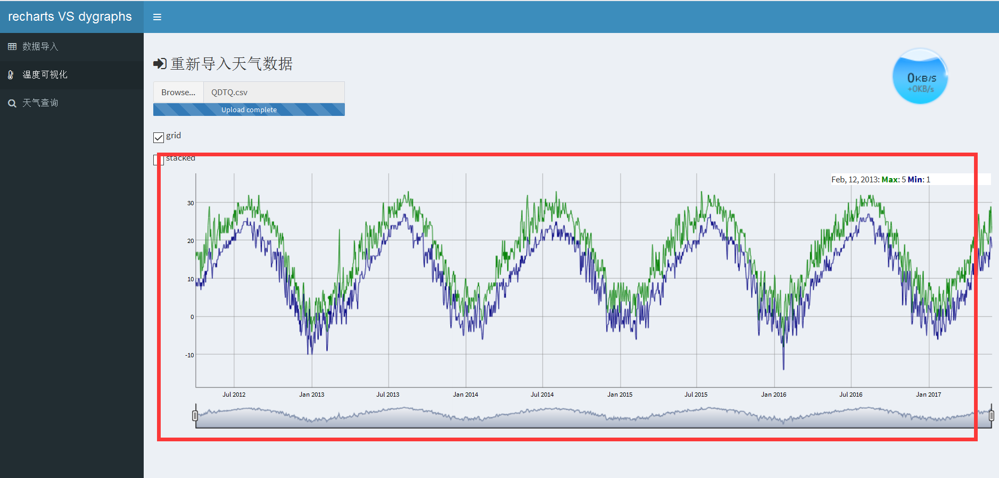

# recharts 与 dygraphs 在shiny中不可并存？

**XuJing**

(Inter-Credit Technology Co., Ltd. Algorithm Engineer) 

## 问题叙述

在16年的工作中和近期的项目分析中，我发现在shinydashbord提供的框架下，如果使用
recharts2.0对应的绘图，就无法在shiny中添加dygraphs绘图。（不存在shiny版本问题）

1.两个包并存时的显示：

！[dy1](pic/test1.png)

2.去掉recharts只留dygraphs的显示

## 如何解决

应该怎样解决呢？大牛！